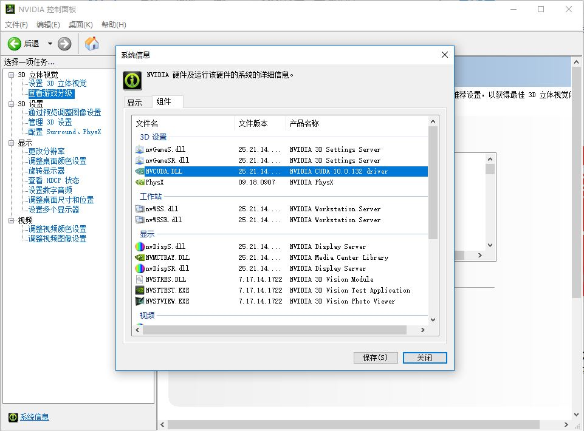

记录一下使用GPU的过程  
学习深度学习，绕不开GPU，在老师的帮助和支持下，终于有了一块GPU！    
一、安装GPU  
GPU是什么呢？我目前还不知道，只知道用于计算速度比较快，和很久以前听说的显卡貌似是一个东西，在还没有正式投入使用体会到它的优势之前，我还是不说了。   
打开主机箱，把GPU卡在它合适的位置，插上连接线，合上主机箱，完成GPU的安装。   
下载“驱动精灵”，检测未安装设备，完成GPU的安装，这个时候，就会有一个GPU控制面板出现（我的就出现在桌面上），在里面可以看GPU的各种信息。  
二、GPU与tensorflow  
pycharm+anaconda+CUDA+Cudnn  
  
先检查GPU的型号适应什么版本的CUDA，这个一定要查清楚，我在安装的时候，看到tensorflow最多只支持CUDA 9，就下载了CUDA 9，果然就出现了"CUDA driver version is insufficient for CUDA runtime version"的错误，最后卸掉重新安装的CUDA 10。  

打开Anaconda Prompt，安装tensorflow-gpu  
为了让他快一些，加入镜像网站的下载地址  
`conda config --add channels https://mirrors.ustc.edu.cn/anaconda/pkgs/free/`  
`conda config --set show_channel_urls yes`  
然后输入`conda install tensorflow-gpu`  
在下载的过程中，发现下载了cudnn这个库，以及CUDA10... 因为在找安装教程的时候，发现可能anaconda可以一下子完成tensorflow-gpu的安装，但是当我把CUDA卸载了之后，发现还是不行，所以我也不知道是为什么...  

没有再下载cudnn，我的CycleGAN，就以比GPU上快15倍的速度跑了起来（开心）  
